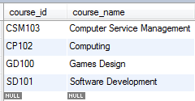
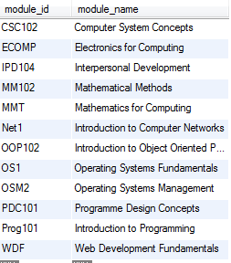
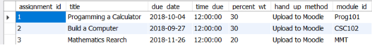



# Structured Query Language (SQL) - Project


***This assignment is worth 100% of your overall mark***

***Upload your completed assessment to the link provided on Moodle.***

*Plagiarism of any kind will incur a 0% mark.*

*Late submission will not be accepted - 0% will be awarded for late hand-in.*

**Guidelines:**

*You are responsible for implementing the database for a student app that allows students to view their time table, view assingments due and take part in a forum.  The following contains the schema for the database.*
## **Relational Schema:**

**COURSE**(course\_id, course\_name)

**MODULE** (module\_id  module\_name, course\_id\*)

**COURSE\_MODULE**(course\_ID\*, module\_ID\*)

**USER**(user\_id, user\_name, email, date\_created,  phone, course\_id \*)

**GRADE**(module\_id\* , student\_id\*, grade)

**TIMETABLE** (module\_id\*, semester, day, time, room , class\_group)

**ASSIGNMENT**(assignment\_id, title, due\_date, perentage\_wt, hand\_up\_method, module\_id\*)

**FORUM**(question\_id, question\_title, question\_content, date\_time, user\_id)

**REPLY**( reply\_id, question\_id\*, reply\_content, date\_time, user\_id\*)

*Note: underline attributes make up the primary key for that relation,  \* indicates the attribute is a foreign key.*

*If data or the case study is unclear, or information missing (e.g. data types, column constraints etc.) please make assumptions as to what it most appropriate.*

*Save the file as a script file, i.e. with a .SQL extension that can be run.  There should be no text in the file that is not code or comments.*
**


**Section A – Creating the tables**:

1. Write the MySQL commands to create the tables from the relational schema above.  

   *Take the following into consideration when creating the relations*:

- Decide on the **most appropriate data types** for each attribute
- Create correct constraints for primary (underlined) and foreign keys (\*).
- All primary and foreign key to be created be at table level, and should be named.

- COURSE:
  - course\_id should be of type varchar(20)
  - course\_name cannot be NULL and must be unique
- MODULE:
  - module\_id should be varchar(255)
  - module\_name cannot be null
- USER:
  - user\_id is an auto\_increment type
  - gender can only be M or F value
  - All fields cannot contain a null value
  - Default value for *county* must ‘Tipperary’
- GRADE
  - Grade is a numeric value
- TIMETABLE
  - Day can only be one of the following values (Mon, Tues, Wed, Thurs, Fri).
  - Semester can only be one of the following values(1, 2, 3, 4, 5, 6, 7, 8)
- ASSIGNMENT
  - assignment\_id should be an auto increment number.
- FORUM
  - question\_id should be an auto increment number.
- REPLY
  - reply\_id should be an auto increment number.

## Answer 1

```sql
CREATE TABLE `Course` (
  `ID` int NOT NULL AUTO_INCREMENT,
  `Name` char(20) NOT NULL DEFAULT '',
  
  PRIMARY KEY (`ID`),
  KEY `Name` (`Name`)
);
```


**Section B – Inserting records (data) into the tables:**

1. Insert the following data into the Course table:



1. Insert the following records into the Module table:



1. Add in your own data to the *course\_module* table and the *timetable* table (3 records).
1. Insert the following data into the assignment table.

   

1. Enter two users into the user’s table (make this up yourself).
1. Create two questions in the forum tables.
1. Provide one reply to one of your questions.

**Section C – View and Queries**

Write SQL commands for the following

1. Create a View that shows the timetable for Group 1B for semester 1, order by Day, time ascend.  Also show the code to view the data within this View
1. Create a view that shows all free classes for Group 1A for semester 1.
1. Create a view that shows all assignment due (i.e. title, module Name, due date).   Must not show assignment where due date has passed.
1. Create a view that shows the number of day left before the due date for each assignment (title, module name, hand up method, number of day left).  


1

